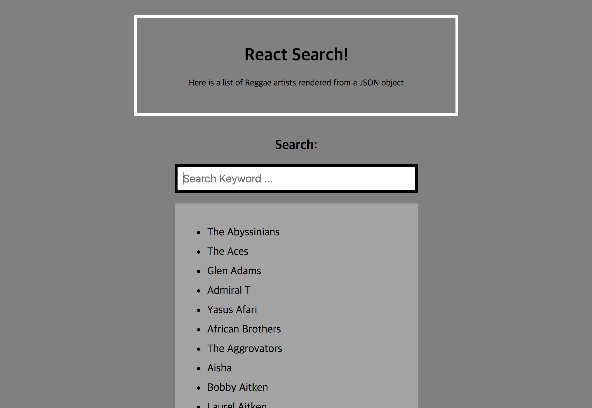
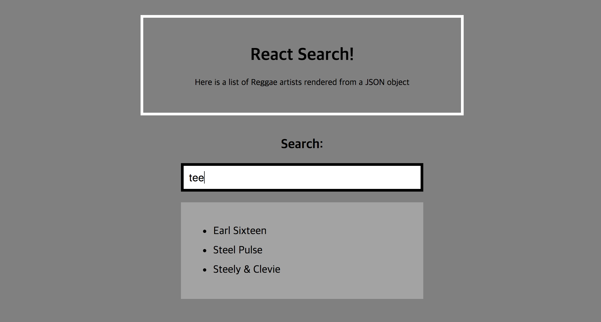

# Simple Realtime Search 만들기 및 리뷰

* [예제선정](http://sean-smith.me/assets/portfolio/25-react-projects/projects/Project_1/index.html)

1. 레게 음악 아티스트 이름목록을 Ajax로 불러와서 리스트로 뿌려줌.
2. 검색창에 키워드를 입력하면 동시에 일치하는 리스트를 필터링하여 보여줌.

 

## 설계

* 사용한 도구: `create-react-app`
* 컴포넌트 구조
  * SearchApp (멍청)
    * Header (멍청)
    * **MainSection (똑똑)** => this.state.searchKey
      * **SearchInput (멍청? 똑똑?)**
      * **SearchList (똑똑)** => this.state.filteredList
        * SearchListItem (멍청)
        * SearchListItem (멍청)
        * ….

 

## 공부한 내용

### 이슈

* 컴포넌트를 나누는 기준이 뭘까?에 대한 고민
  * 멍청한 컴포넌트, 똑똑한 컴포넌트
    * 함수형 컴포넌트 사용해 봄 + 어느 때 유용한가?
  * 컴포넌트 구조 리팩토링(?) -> 전후 비교. 나만의 규칙(?) 세움
* 리액트가 데이터를 어떻게 관리하는지? 궁금해짐. 컨셉
  * flux랑 redux가 뭐지?
* ajax로 데이터를 불러온 후 SearchList를 그려줘야 한다
  * 생명주기 componentDidMount
* 반복된 목록을 렌더링하는 이슈
  * 템플릿으로 html string을 만들었다가 변경 => 컴포넌트 활용하기
  * key속성을 안써서 에러남. key를 왜 써야 하는가??
* 최초 로딩시 SearchInput에 포커스를 줘보자
  * ref 속성을 활용

 
